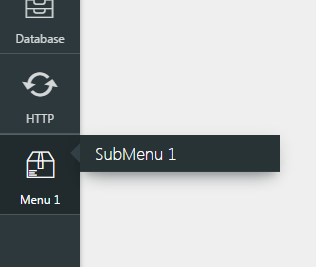
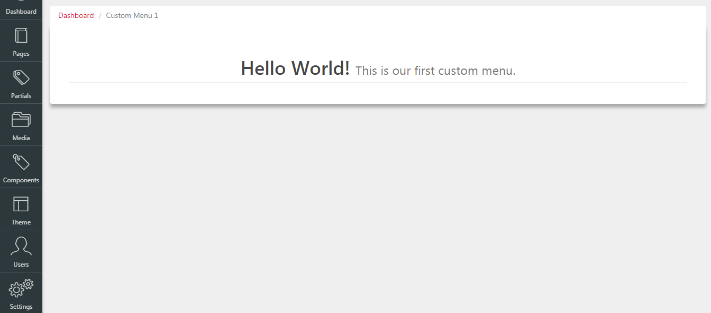

# RevCMS - CMS for Laravel
RevCMS is a Content Management System made for Developers and Non-Developers. Every content in a website can be managed by using raw code or WYSIWYG. _**RevCMS is a CMS that writes code for you.**_

## Documentation

#### Table of Contents
- [Installation]()
- [Introduction]()
- [Modules]()
- [Router](#router)
	- [Custom Sidebar Menu]()
- [CMS]()
- [Theme]()
- [Components](#components)

## Installation
RevCMS is just a package and just like any other package, you can add/remove it in your project anytime you want.

## Router

### Custom Sidebar Menu

By registering custom admin menu you only need to create your own custom service provider (read more about laravel's [service providers](http://laravel.com/docs/5.3/providers)) and add it inside your config/app.php:
##### For Example:
###### Insude your terminal, run the following artisan command:
	$ php artisan make:provider CustomMenuServiceProvider

###### Inside your config/app.php, register your service provider:
Make sure to add it after RevCMS' Service Provider.

	RevCMS\RevServiceProvider::class,
	App\Providers\CustomMenuServiceProvider::class,

###### You can register Custom Admin Menu by using the following syntax inside your service provider's register method: 
	\RevCMS::router()
	        ->register(array(
	                'uri' => '/custom-menu',
	                'uses' => 'CustomMenuController@index',
	                'title' => 'Menu 1',
	                'iconClass' => 'revicon-package',
	                'params' => array(
	                    'middleware' => array(),
	                    ),
	                'children' => array(
	                        array(
	                                'uri' => '/custom-submenu-1',
	                                'uses' => 'CustomMenuController@submenu1',
	                                'title' => 'SubMenu 1',
	                                'params' => array(),
	                            ),
	                    ),
	            ));
###### Arguments:
- **uri _(Required)_** - Route URI.
- **uses _(Required)_** - Route's action.
- **title _(Required)_** - Menu title.
- **params _(Optional)_** - Other parameters for a route.
- **children _(Optional)_** - Submenu. Accepts the same arguments as the parent menu except the 'iconClass'.

###### Output:
You can now see your custom menu at the bottom part of the sidebar.

##### For the custom menu panel, you only need to create a new blade file and render it using RevCMS' dashboard module, by using the following syntax:
Inside CustomMenuController add the following code:
	
	public function index()
	{
	    return \RevCMS::dashboard()
	                    ->render('view', 'menu_bar_title', menu_order);
	}
###### Arguments:
- **view** - Name of the view.
- **menu_bar_title** - Title to be displayed on the tab.
- **menu_order** - Order of the menu, starts at 1.

##### You can now put whatever you want inside your blade file, for example:
	

		<h1 class="text-center page-header">
			Hello World!
			<small>
				This is our first custom menu.
			</small>
		</h1>
	

##### Output:

#--------------------------------------------------------
# Pending Tasks...
## Admin Model Registration
	\RevCMS::cms()->admin()->register('App\Post');

## Page Update
	...
## Page Delete
	...
## Theming
	...

## License

The Laravel framework is open-sourced software licensed under the [MIT license](http://opensource.org/licenses/MIT).
