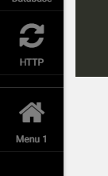

# RevCMS - CMS for Laravel

RevCMS is a Content Management System made for Developers and Non-Developers. Every content in a website can be managed by using raw code or WYSIWYG. 

## Documentation

#### Table of Contents
[Installation]()

[Introduction]()

[Modules]()

[Router](#router)

[CMS]()

[Theme]()

[Components](#components)

## \# Router

### Custom Admin Menu

By registering custom admin menu you need only to create your custom service provider (read more about laravel's [service providers](http://laravel.com/docs/5.3/providers)) and add it inside your config/app.php:
##### For Example:
###### In your terminal, run:
	php artisan make:provider CustomMenuServiceProvider

###### In your config/app.php, add your service provider:
Make sure to add it after RevCMS' Service Provider.

	RevCMS\RevServiceProvider::class,
	App\Providers\CustomMenuServiceProvider::class,

###### You can register Custom Admin Menu by using the following syntax inside your service provider's register method: 
	\RevCMS::router()
	        ->register('web', array(
	                'uri' => '/custom-menu',
	                'uses' => 'CustomMenuController@index',
	                'type' => 'get',
	                'title' => 'Menu 1',
	                'iconClass' => 'fa fa-home',
	                'params' => array(
	                	'middleware' => array(),
	                	),
	            ));
###### Arguments:

###### Output:
You can now see your custom menu at the very bottom.

## License

The Laravel framework is open-sourced software licensed under the [MIT license](http://opensource.org/licenses/MIT).
